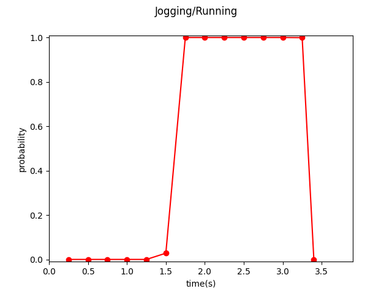

# Video Action Recognition
Smart home technologies can help take care of elderly people or children in their daily life. In this project, I built an application that can detect running/jogging action via visual sensor. Given an RGB video, the model will output the probability of detecting running/jogging in that time period. Running/Jogging is a dangerous action at home, so, in application, when the model detects running/jogging from the home visual sensor, it can send warning messages to the family member and avoid injuries. 

We use [SlowFast](https://github.com/facebookresearch/SlowFast), proposed by Facebook Research Team, as our pretrained model for feature extraction, and fintune the model on UTD-MHAD dataset.
(This repository is for CSCE 636 Deep Learning Project)

# Goal
Detect **jogging/running** in video.

# Dataset
[Kinetics-400](https://deepmind.com/research/open-source/kinetics) for pretrained model.

[UTD-MHAD](https://personal.utdallas.edu/~kehtar/UTD-MHAD.html) for fine tuning.

# Installation
## Requirements
- Python >= 3.6
- Numpy
- Moviepy
- PyTorch 1.3
- [fvcore](https://github.com/facebookresearch/fvcore/): `pip install 'git+https://github.com/facebookresearch/fvcore'`
- [torchvision](https://github.com/pytorch/vision/) that matches the PyTorch installation.
  You can install them together at [pytorch.org](https://pytorch.org) to make sure of this.
- simplejson: `pip install simplejson`
- GCC >= 4.9
- PyAV: `conda install av -c conda-forge`
- ffmpeg (4.0 is prefereed, will be installed along with PyAV)
- PyYaml: (will be installed along with fvcore)
- OpenCV: `pip install opencv-python`
- torchvision: `pip install torchvision` or `conda install torchvision -c pytorch`
- [Detectron2](https://github.com/facebookresearch/detectron2): 
```
    pip install -U torch torchvision cython
    pip install -U 'git+https://github.com/facebookresearch/fvcore.git' 'git+https://github.com/cocodataset/cocoapi.git#subdirectory=PythonAPI'
    git clone https://github.com/facebookresearch/detectron2 detectron2_repo
    pip install -e detectron2_repo
    You could find more details at https://github.com/facebookresearch/detectron2/blob/master/INSTALL.md
```

# How to run
- Clone this repository:
```bash
$ git clone --recursive https://github.com/yyyjoe/SlowFast.git
```

- Run dataset.sh to Download [UTD-MHAD](https://personal.utdallas.edu/~kehtar/UTD-MHAD.html) dataset and process the data:
```bash
$ cd SlowFast
$ sh ./UTD/dataset.sh
# The dataset folder called RGB will be download under /Slowfast/UTD/RGB
```

- Download the pretrained Model [Slowfast_8x8_R50] (https://dl.fbaipublicfiles.com/pyslowfast/model_zoo/kinetics400/SLOWFAST_8x8_R50.pkl).

- Perform training (output checkpoint, fig.png, and timeLabel.json.)
```
python tools/run_net.py \
  --cfg configs/Kinetics/c2/SLOWFAST_8x8_R50.yaml \
  DATA.PATH_TO_DATA_DIR path_to_RGB_folder \
  TRAIN.CHECKPOINT_FILE_PATH path_to_Slowfast_8x8_R50_checkpoint \
  TRAIN.ENABLE True \
  ATTENTION.ENABLE True \
```

# Testing
Perform testing on given demo video.

<!--- 
- Trained model for 50 epochs can be download [here](https://drive.google.com/file/d/1te3tp1lc3QyG5ljgbYERAP3PrxAO2Dii/view?usp=sharing) (the model used for demo).
-->

- Perform Testing on part 8. [Model](https://drive.google.com/file/d/13KmD7VIXGSCMrqvaga5ETxRDrHlhhlnS/view?usp=sharing)
```
python tools/run_net.py \
  --cfg configs/Kinetics/c2/SLOWFAST_8x8_R50.yaml \
  TEST.CHECKPOINT_TYPE pytorch \
  TEST.CHECKPOINT_FILE_PATH  path_to_checkpoint \
  TEST.DEMO_PATH path_to_demo_video\
  TEST.ENABLE True \
  ATTENTION.ENABLE True \
```

- Perform Testing on part 6,7. [Model](https://drive.google.com/file/d/1te3tp1lc3QyG5ljgbYERAP3PrxAO2Dii/view?usp=sharing)
```
python tools/run_net.py \
  --cfg configs/Kinetics/c2/SLOWFAST_4x16_R50.yaml \
  TEST.CHECKPOINT_TYPE pytorch \
  TEST.CHECKPOINT_FILE_PATH  path_to_checkpoint \
  TEST.DEMO_PATH path_to_demo_video\
  TEST.ENABLE True \
```

- Perform Testing on part 5. [Model](https://drive.google.com/file/d/1s_AMdFbyD6GMao9zisYfTWPezp6yDdf5/view?usp=sharing)
```
python tools/run_net.py \
  --cfg configs/Kinetics/c2/SLOWFAST_8x8_R50.yaml \
  TEST.CHECKPOINT_TYPE pytorch \
  TEST.CHECKPOINT_FILE_PATH  path_to_checkpoint \
  TEST.DEMO_PATH path_to_demo_video\
  TEST.ENABLE True \
```

- Perform Testing on part 4. [Model](https://drive.google.com/file/d/1z8W499vpMrFdBFnSYvKBf54MMr0_61XO/view?usp=sharing)
```
python tools/run_net.py \
  --cfg configs/Kinetics/c2/SLOWFAST_8x8_R50.yaml \
  TEST.CHECKPOINT_TYPE pytorch \
  TEST.CHECKPOINT_FILE_PATH  path_to_checkpoint \
  TEST.DEMO_PATH path_to_demo_video\
  TEST.ENABLE True \
```


# Demo
<!--- part8 -->
- Use [Part8 model](https://drive.google.com/file/d/13KmD7VIXGSCMrqvaga5ETxRDrHlhhlnS/view?usp=sharing) for demo.

<!--- part6,7
- [Final Trained Model](https://drive.google.com/file/d/1te3tp1lc3QyG5ljgbYERAP3PrxAO2Dii/view?usp=sharing) for demo. (the same as trained model for 50 epochs above)
-->

<!--- part5
- [Final Trained Model](https://drive.google.com/file/d/1s_AMdFbyD6GMao9zisYfTWPezp6yDdf5/view?usp=sharing) for demo. (the same as trained model for 50 epochs above)
-->



